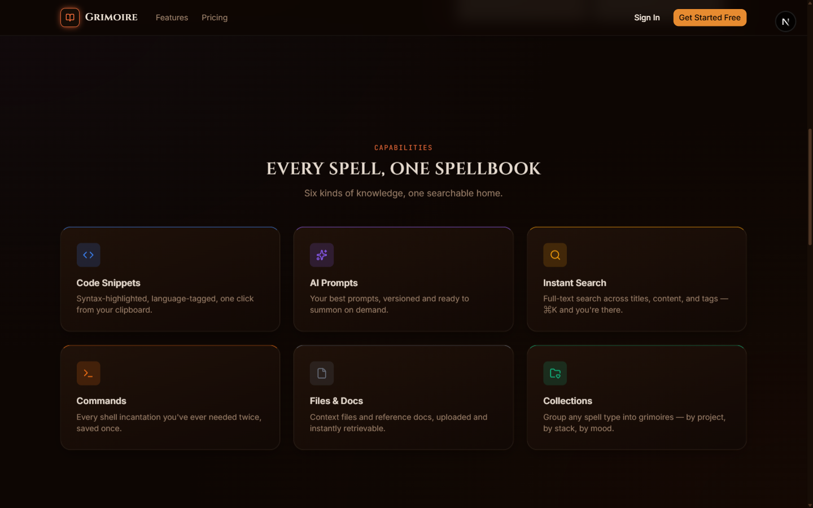
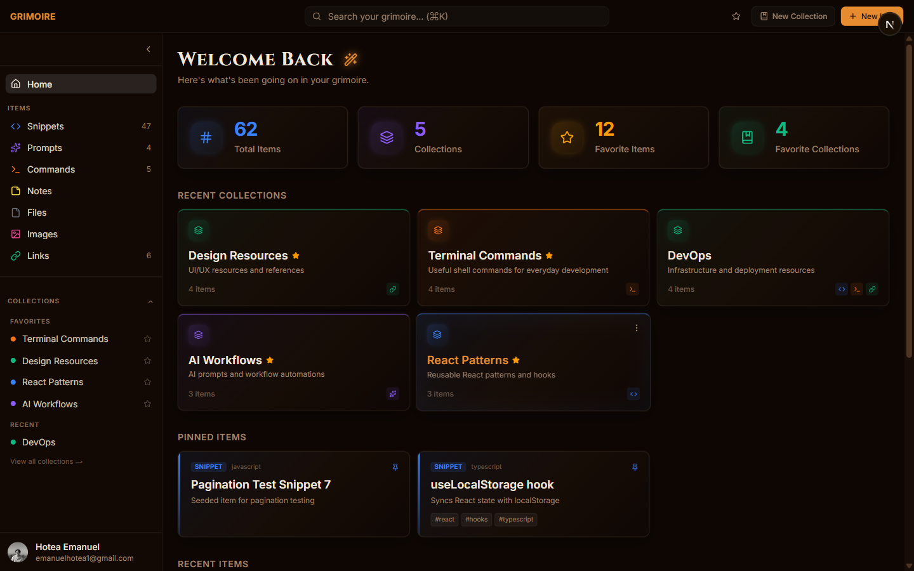
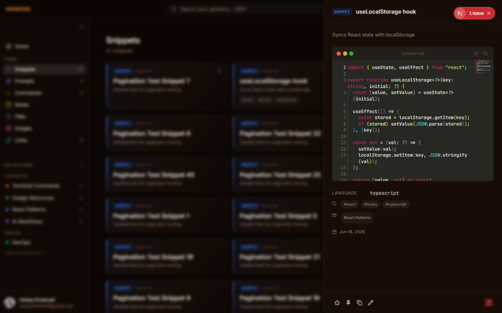
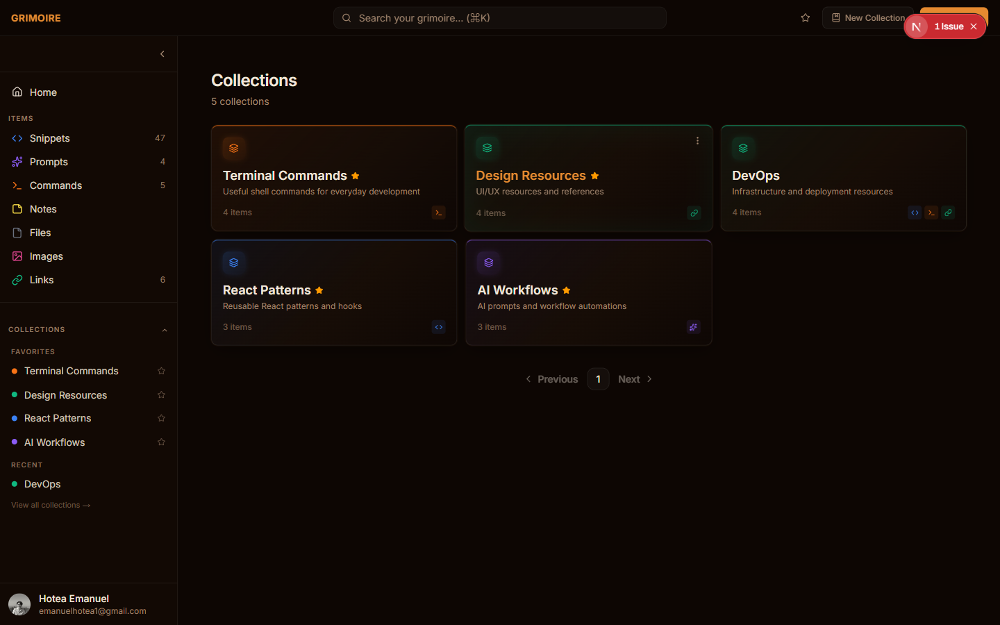
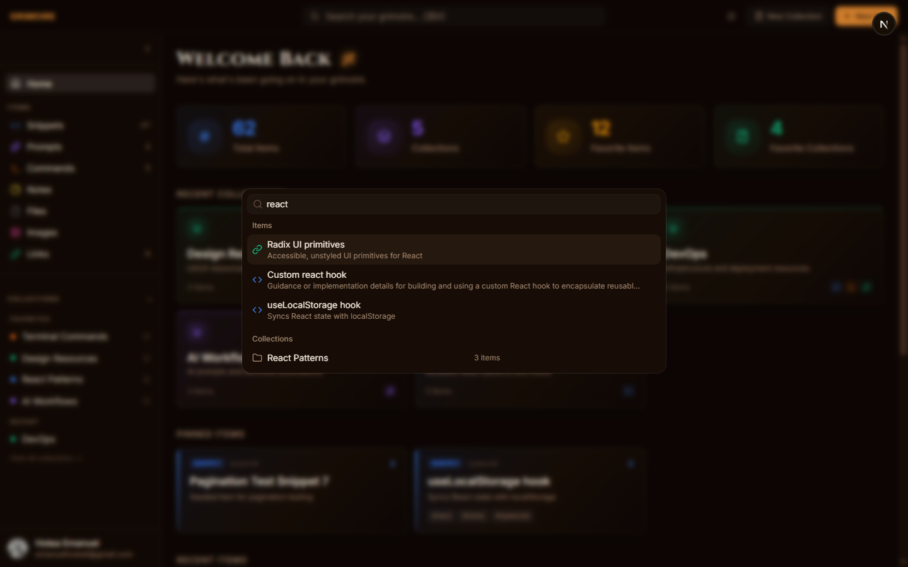

# Grimoire

> A fast, searchable, AI-enhanced knowledge hub for developers. One place for every snippet, prompt, command, link, note, and file you reach for daily.

Developers scatter their essential resources across a dozen tools — snippets in VS Code, prompts in chat history, links in browser bookmarks, commands in `.bashrc`. **Grimoire** centralizes all of it into a single, fast, themed workspace with full-text search, collections, and AI-assisted organization.


## Features



- **Six item types** — Snippets, Prompts, Notes, Commands, Links, Files, and Images, each with type-specific rendering (syntax-highlighted code editor, markdown editor, file previews, etc.)
- **Collections** — group items of any type together; an item can belong to multiple collections at once
- **Global search** — a `⌘K` / `Ctrl+K` command palette with fuzzy full-text search across titles, content, and tags
- **Favorites & pinning** — star anything, or pin items to the top of their list
- **AI features (Pro)** — auto-tag suggestions, one-line summaries, "explain this code," and a prompt optimizer, all powered by OpenAI
- **Auth** — email/password with email verification, or GitHub OAuth
- **Dark mode** by default, with a warm, hand-tuned "grimoire" theme throughout

## Screenshots

| Dashboard | Item detail & code editor |
| --- | --- |
|  |  |

| Collections | Command palette search |
| --- | --- |
|  |  |

## Tech Stack

| Layer | Technology |
| --- | --- |
| Framework | Next.js 16 (App Router) / React 19 |
| Language | TypeScript (strict) |
| Database | PostgreSQL via Neon |
| ORM | Prisma 6 |
| Auth | NextAuth v5 (Auth.js) — email/password + GitHub OAuth |
| File Storage | Cloudflare R2 (S3-compatible) |
| AI | OpenAI (`gpt-5-nano`, Responses API) |
| Styling | Tailwind CSS v4 |
| Components | shadcn/ui (Radix / Base UI primitives) |
| Payments | Stripe (subscriptions + webhooks) |
| Testing | Vitest |

## Getting Started

```bash
npm install
npm run dev      # start dev server at localhost:3000
npm run build    # production build
npm run lint     # run ESLint
npm run test     # run unit tests
```

Copy `.env.example` to `.env` and fill in your own database, auth, R2, OpenAI, and Stripe credentials. Schema changes are managed exclusively through Prisma migrations:

```bash
npx prisma migrate dev
```

## Project Structure

```
src/
├── app/            # Next.js App Router routes (pages + API routes)
├── components/     # Feature-organized React components
├── lib/            # Prisma client, auth config, R2/Stripe/OpenAI helpers, DB queries
├── actions/        # Server Actions
├── hooks/          # Shared custom hooks
└── types/          # Shared TypeScript types
prisma/
├── schema.prisma   # Data models
└── migrations/     # Migration history
```

## License

This is a personal project, currently unlicensed for public reuse.
