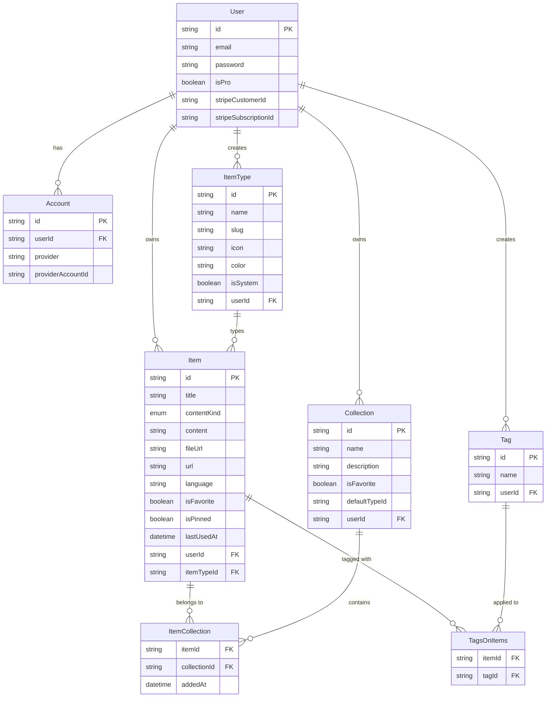

# Grimoire — Project Overview

> A fast, searchable, AI-enhanced knowledge hub for developers. One place for every snippet, prompt, command, link, note, and file you reach for daily.

---

## Table of Contents

1. [Problem Statement](#1-problem-statement)
2. [Target Users](#2-target-users)
3. [Feature Set](#3-feature-set)
4. [Data Models & Prisma Schema](#4-data-models--prisma-schema)
5. [Entity Relationship Diagram](#5-entity-relationship-diagram)
6. [Tech Stack](#6-tech-stack)
7. [URL & Route Structure](#7-url--route-structure)
8. [Item Types Reference](#8-item-types-reference)
9. [Monetization](#9-monetization)
10. [UI/UX Guidelines](#10-uiux-guidelines)
11. [Project Conventions](#11-project-conventions)

---

## 1. Problem Statement

Developers scatter their essential resources across too many places:

| Resource | Where it lives today |
|---|---|
| Code snippets | VS Code, Notion, GitHub Gists |
| AI prompts | Chat histories, random `.txt` files |
| Context files | Buried inside project directories |
| Useful links | Browser bookmarks |
| Documentation | Random folders, Notion pages |
| Terminal commands | `.bashrc`, shell history, sticky notes |
| Project templates | GitHub Gists, local zip archives |

This forces constant context switching, causes knowledge loss, and leads to inconsistent workflows. **Grimoire** is a single, fast, AI-enhanced hub that replaces all of the above.

---

## 2. Target Users

| Persona | Core Need |
|---|---|
| **Everyday Developer** | Quickly grab snippets, commands, and links without breaking flow |
| **AI-first Developer** | Store and refine prompts, system messages, context files, and workflows |
| **Content Creator / Educator** | Manage code blocks, explanations, and course notes in one place |
| **Full-stack Builder** | Collect patterns, boilerplates, and API examples across projects |

---

## 3. Feature Set

### A. Items & Item Types

Items are the core unit of the app. Each item has a **type** that determines how it is rendered, stored, and accessed.

**System types** (built-in, not editable by users):

| Type | Content Kind | Pro Only |
|---|---|---|
| `snippet` | text | No |
| `prompt` | text | No |
| `note` | text | No |
| `command` | text | No |
| `link` | url | No |
| `file` | file upload | Yes |
| `image` | file upload | Yes |

> Users will eventually be able to create **custom types** (planned Pro feature).

Items are accessible at type-scoped URLs: `/items/snippets`, `/items/prompts`, etc.

Items can be created and accessed quickly via a **slide-in drawer** — no full page navigation required.

---

### B. Collections

Collections group items of any type. Items can belong to **multiple collections** simultaneously (many-to-many relationship).

Examples:
- `React Patterns` — snippets, notes
- `Context Files` — files
- `Python Snippets` — snippets
- `Interview Prep` — snippets, notes, links

---

### C. Search

Full-text search across:
- Item title
- Item content
- Tags
- Item type

---

### D. Authentication

- Email/password
- GitHub OAuth

Powered by **NextAuth v5** (Auth.js).

---

### E. Core Features

- Favorite collections and items
- Pin items to top
- Recently used items feed
- Import code from a local file
- Markdown editor for text-type items (with syntax highlighting)
- File upload for `file` and `image` types
- Export data (JSON / ZIP — Pro)
- Add/remove items to/from multiple collections
- View which collections an item belongs to
- Dark mode (default), light mode available

---

### F. AI Features (Pro only)

| Feature | Description |
|---|---|
| **Auto-tag suggestions** | AI suggests relevant tags when saving an item |
| **AI Summary** | One-line summary generated for long items |
| **Explain This Code** | Plain-English explanation of a snippet or command |
| **Prompt Optimizer** | Rewrites and improves AI prompts for clarity and effectiveness |

> During development, all features (including AI and Pro-only types) are accessible to every user.

---

## 4. Data Models & Prisma Schema

> **Migration policy:** Never run `prisma db push` in any environment. All schema changes must go through Prisma migrations (`prisma migrate dev` locally, applied to production via CI).

```prisma
// schema.prisma

generator client {
  provider = "prisma-client-js"
}

datasource db {
  provider = "postgresql"
  url      = env("DATABASE_URL")
}

// ─────────────────────────────────────────────
// AUTH (extends NextAuth default tables)
// ─────────────────────────────────────────────

model User {
  id                    String    @id @default(cuid())
  name                  String?
  email                 String    @unique
  emailVerified         DateTime?
  image                 String?
  password              String?   // null for OAuth users
  isPro                 Boolean   @default(false)
  stripeCustomerId      String?   @unique
  stripeSubscriptionId  String?   @unique
  createdAt             DateTime  @default(now())
  updatedAt             DateTime  @updatedAt

  accounts    Account[]
  sessions    Session[]
  items       Item[]
  itemTypes   ItemType[]
  collections Collection[]
  tags        Tag[]
}

model Account {
  id                String  @id @default(cuid())
  userId            String
  type              String
  provider          String
  providerAccountId String
  refresh_token     String?
  access_token      String?
  expires_at        Int?
  token_type        String?
  scope             String?
  id_token          String?
  session_state     String?

  user User @relation(fields: [userId], references: [id], onDelete: Cascade)

  @@unique([provider, providerAccountId])
}

model Session {
  id           String   @id @default(cuid())
  sessionToken String   @unique
  userId       String
  expires      DateTime

  user User @relation(fields: [userId], references: [id], onDelete: Cascade)
}

model VerificationToken {
  identifier String
  token      String   @unique
  expires    DateTime

  @@unique([identifier, token])
}

// ─────────────────────────────────────────────
// ITEM TYPES
// ─────────────────────────────────────────────

model ItemType {
  id       String  @id @default(cuid())
  name     String  // "snippet" | "prompt" | "note" | "command" | "link" | "file" | "image"
  slug     String  @unique // URL-safe: "snippets", "prompts", etc.
  icon     String  // Lucide icon name: "Code", "Sparkles", etc.
  color    String  // Hex color: "#3b82f6"
  isSystem Boolean @default(false)  // true = built-in, cannot be deleted
  userId   String? // null for system types

  user  User?  @relation(fields: [userId], references: [id], onDelete: Cascade)
  items Item[]
}

// ─────────────────────────────────────────────
// ITEMS
// ─────────────────────────────────────────────

enum ContentKind {
  TEXT
  FILE
  URL
}

model Item {
  id          String      @id @default(cuid())
  title       String
  contentKind ContentKind
  content     String?     // text content; null for file/url types
  fileUrl     String?     // Cloudflare R2 URL; null for text/url types
  fileName    String?     // original filename
  fileSize    Int?        // bytes
  url         String?     // for link types
  description String?
  language    String?     // e.g. "typescript", "python" — used for syntax highlighting
  isFavorite  Boolean     @default(false)
  isPinned    Boolean     @default(false)
  lastUsedAt  DateTime?   // updated on access, drives "recently used" feed
  createdAt   DateTime    @default(now())
  updatedAt   DateTime    @updatedAt

  userId     String
  itemTypeId String

  user            User             @relation(fields: [userId], references: [id], onDelete: Cascade)
  itemType        ItemType         @relation(fields: [itemTypeId], references: [id])
  tags            TagsOnItems[]
  collections     ItemCollection[]
}

// ─────────────────────────────────────────────
// COLLECTIONS
// ─────────────────────────────────────────────

model Collection {
  id            String   @id @default(cuid())
  name          String
  description   String?
  isFavorite    Boolean  @default(false)
  defaultTypeId String?  // preferred type for empty collections
  createdAt     DateTime @default(now())
  updatedAt     DateTime @updatedAt

  userId String

  user  User             @relation(fields: [userId], references: [id], onDelete: Cascade)
  items ItemCollection[]
}

// ─────────────────────────────────────────────
// JOIN TABLES
// ─────────────────────────────────────────────

model ItemCollection {
  itemId       String
  collectionId String
  addedAt      DateTime @default(now())

  item       Item       @relation(fields: [itemId], references: [id], onDelete: Cascade)
  collection Collection @relation(fields: [collectionId], references: [id], onDelete: Cascade)

  @@id([itemId, collectionId])
}

model Tag {
  id     String @id @default(cuid())
  name   String
  userId String

  user  User          @relation(fields: [userId], references: [id], onDelete: Cascade)
  items TagsOnItems[]

  @@unique([name, userId]) // tags are scoped per user
}

model TagsOnItems {
  itemId String
  tagId  String

  item Item @relation(fields: [itemId], references: [id], onDelete: Cascade)
  tag  Tag  @relation(fields: [tagId], references: [id], onDelete: Cascade)

  @@id([itemId, tagId])
}
```

---

## 5. Entity Relationship Diagram



---

## 6. Tech Stack

| Layer | Technology | Notes |
|---|---|---|
| **Framework** | Next.js 15 / React 19 | App Router, SSR + client components |
| **Language** | TypeScript | Strict mode enabled |
| **Database** | PostgreSQL via Neon | Serverless Postgres |
| **ORM** | Prisma 6 | Migrations only — no `db push` |
| **Auth** | NextAuth v5 (Auth.js) | Email/password + GitHub OAuth |
| **File Storage** | Cloudflare R2 | S3-compatible API |
| **AI** | OpenAI `gpt-4o-mini` | Used for tagging, summaries, explain, optimize |
| **CSS** | Tailwind CSS v4 | Utility-first |
| **Components** | shadcn/ui | Built on Radix UI primitives |
| **Payments** | Stripe | Subscriptions + webhooks |
| **Caching** | Redis (Upstash) | Optional; session caching, rate limiting |

> **AI model note:** Use `gpt-4o-mini` for cost-effective AI features. Upgrade to `gpt-4o` for prompt optimizer if quality demands it.

---

## 7. URL & Route Structure

```
/                          → Landing / marketing page
/sign-in                   → Email/password or GitHub OAuth
/sign-up                   → Registration

/dashboard                 → Main app shell (sidebar + content)
/dashboard/items           → All items (default view)
/dashboard/items/snippets  → Filtered by type: snippets
/dashboard/items/prompts   → Filtered by type: prompts
/dashboard/items/commands  → Filtered by type: commands
/dashboard/items/notes     → Filtered by type: notes
/dashboard/items/links     → Filtered by type: links
/dashboard/items/files     → Filtered by type: files (Pro)
/dashboard/items/images    → Filtered by type: images (Pro)
/dashboard/collections          → All collections
/dashboard/collections/[id]     → Single collection view
/dashboard/search               → Search results
/dashboard/settings             → Account, preferences, billing
/dashboard/settings/billing     → Stripe portal / upgrade

/api/items                 → CRUD for items
/api/items/[id]            → Single item operations
/api/collections           → CRUD for collections
/api/collections/[id]/items → Add/remove items from a collection
/api/tags                  → Tag management
/api/upload                → Cloudflare R2 signed URL generation
/api/ai/tag                → AI auto-tagging
/api/ai/summarize          → AI summary
/api/ai/explain            → AI code explanation
/api/ai/optimize           → AI prompt optimizer
/api/webhooks/stripe       → Stripe subscription events
/api/auth/[...nextauth]    → NextAuth handler
```

---

## 8. Item Types Reference

| Type | Slug | Icon (Lucide) | Color | Hex | Content Kind | Pro Only |
|---|---|---|---|---|---|---|
| Snippet | `snippets` | `Code` | Blue | `#3b82f6` | TEXT | No |
| Prompt | `prompts` | `Sparkles` | Purple | `#8b5cf6` | TEXT | No |
| Note | `notes` | `StickyNote` | Yellow | `#fde047` | TEXT | No |
| Command | `commands` | `Terminal` | Orange | `#f97316` | TEXT | No |
| Link | `links` | `Link` | Emerald | `#10b981` | URL | No |
| File | `files` | `File` | Gray | `#6b7280` | FILE | Yes |
| Image | `images` | `Image` | Pink | `#ec4899` | FILE | Yes |

**Usage in code:**

```ts
// lib/item-types.ts
import {
  Code,
  Sparkles,
  StickyNote,
  Terminal,
  Link,
  File,
  Image,
} from "lucide-react";

export const SYSTEM_ITEM_TYPES = [
  { name: "Snippet",  slug: "snippets", icon: Code,       color: "#3b82f6", contentKind: "TEXT" },
  { name: "Prompt",   slug: "prompts",  icon: Sparkles,   color: "#8b5cf6", contentKind: "TEXT" },
  { name: "Note",     slug: "notes",    icon: StickyNote, color: "#fde047", contentKind: "TEXT" },
  { name: "Command",  slug: "commands", icon: Terminal,    color: "#f97316", contentKind: "TEXT" },
  { name: "Link",     slug: "links",    icon: Link,        color: "#10b981", contentKind: "URL"  },
  { name: "File",     slug: "files",    icon: File,        color: "#6b7280", contentKind: "FILE", isPro: true },
  { name: "Image",    slug: "images",   icon: Image,       color: "#ec4899", contentKind: "FILE", isPro: true },
] as const;
```

---

## 9. Monetization

### Plans

| Feature | Free | Pro ($8/mo · $72/yr) |
|---|---|---|
| Items | 50 total | Unlimited |
| Collections | 3 | Unlimited |
| Item types | All except file & image | All types |
| File & image uploads | ✗ | ✓ |
| Custom types | ✗ | ✓ (planned) |
| Basic search | ✓ | ✓ |
| AI auto-tagging | ✗ | ✓ |
| AI code explanation | ✗ | ✓ |
| AI prompt optimizer | ✗ | ✓ |
| Export (JSON / ZIP) | ✗ | ✓ |
| Priority support | ✗ | ✓ |

### Stripe Integration

- Webhook endpoint: `/api/webhooks/stripe`
- Key events to handle:
  - `checkout.session.completed` → set `isPro = true`, store `stripeCustomerId` + `stripeSubscriptionId`
  - `customer.subscription.deleted` → set `isPro = false`
  - `invoice.payment_failed` → notify user, optionally revoke access after grace period

> **Dev mode:** Gate checks are bypassed during development — all users have full Pro access.

---

## 10. UI/UX Guidelines

### Design Language

| Attribute | Value |
|---|---|
| Style | Modern, minimal, developer-focused |
| Default mode | Dark (light mode available via toggle) |
| Typography | Clean, generous whitespace, monospace for code |
| Borders | Subtle, low-contrast |
| Shadows | Soft, layered |
| References | Notion, Linear, Raycast |

### Layout

```
┌──────────────────────────────────────────────────────────┐
│  SIDEBAR (collapsible)   │  MAIN CONTENT                 │
│                          │                               │
│  [Logo / App Name]       │  ┌──────┐ ┌──────┐ ┌──────┐  │
│                          │  │Coll. │ │Coll. │ │Coll. │  │
│  ITEM TYPES              │  │ card │ │ card │ │ card │  │
│  ├─ Snippets             │  └──────┘ └──────┘ └──────┘  │
│  ├─ Prompts              │                               │
│  ├─ Commands             │  ┌──────┐ ┌──────┐ ┌──────┐  │
│  ├─ Notes                │  │Item  │ │Item  │ │Item  │  │
│  ├─ Links                │  │ card │ │ card │ │ card │  │
│  ├─ Files (Pro)          │  └──────┘ └──────┘ └──────┘  │
│  └─ Images (Pro)         │                               │
│                          │                               │
│  COLLECTIONS             │                               │
│  ├─ React Patterns       │                               │
│  ├─ Context Files        │                               │
│  └─ + New Collection     │                               │
│                          │                               │
│  [Settings]              │                               │
└──────────────────────────────────────────────────────────┘
```

**Item Drawer (slides in from right)**

```
┌─────────────────────────────────────┐
│  [Type badge]  Item Title      [✕]  │
│─────────────────────────────────────│
│  Content / code / markdown body     │
│                                     │
│  Tags: [react] [hooks] [+ Add]      │
│  Collections: [React Patterns]      │
│  Language: TypeScript               │
│─────────────────────────────────────│
│  [Copy]  [Edit]  [Pin]  [Delete]    │
└─────────────────────────────────────┘
```

### Card Colour Coding

- **Collection cards** — background tinted by the dominant item type in that collection
- **Item cards** — left border colored by item type (using the hex values from §8)

### Responsive Behaviour

| Breakpoint | Sidebar behaviour |
|---|---|
| `≥ 1024px` | Persistent sidebar, collapsible |
| `< 1024px` | Sidebar hidden; accessible via hamburger menu as a drawer overlay |

### Micro-interactions

- Smooth drawer slide-in/out (`transition: transform 200ms ease`)
- Hover states on collection and item cards (subtle background lift)
- Toast notifications for every CUD action (create, update, delete)
- Loading skeletons on initial data fetch — no blank states
- Pinned items float to the top of their list automatically

---

## 11. Project Conventions

### File Structure (recommended)

```
grimoire/
├── app/                        # Next.js App Router
│   ├── (auth)/
│   │   ├── sign-in/
│   │   └── sign-up/
│   ├── (dashboard)/
│   │   ├── layout.tsx          # Sidebar + shell
│   │   ├── items/
│   │   │   └── [type]/         # Dynamic type pages
│   │   ├── collections/
│   │   │   └── [id]/
│   │   └── settings/
│   └── api/
│       ├── items/
│       ├── collections/
│       ├── upload/
│       ├── ai/
│       └── webhooks/stripe/
├── components/
│   ├── ui/                     # shadcn/ui primitives
│   ├── items/                  # ItemCard, ItemDrawer, ItemForm
│   ├── collections/            # CollectionCard, CollectionGrid
│   ├── layout/                 # Sidebar, MobileNav, Shell
│   └── shared/                 # SearchBar, TagInput, TypeBadge
├── lib/
│   ├── prisma.ts               # Prisma client singleton
│   ├── auth.ts                 # NextAuth config
│   ├── r2.ts                   # Cloudflare R2 helpers
│   ├── stripe.ts               # Stripe client + helpers
│   ├── ai.ts                   # OpenAI client + AI feature wrappers
│   └── item-types.ts           # SYSTEM_ITEM_TYPES constant
├── prisma/
│   ├── schema.prisma
│   └── migrations/
└── types/
    └── index.ts                # Shared TypeScript types
```

### Environment Variables

```env
# Database
DATABASE_URL=

# Auth
NEXTAUTH_SECRET=
NEXTAUTH_URL=

# GitHub OAuth
GITHUB_CLIENT_ID=
GITHUB_CLIENT_SECRET=

# Cloudflare R2
R2_ACCOUNT_ID=
R2_ACCESS_KEY_ID=
R2_SECRET_ACCESS_KEY=
R2_BUCKET_NAME=
R2_PUBLIC_URL=

# OpenAI
OPENAI_API_KEY=

# Stripe
STRIPE_SECRET_KEY=
STRIPE_WEBHOOK_SECRET=
NEXT_PUBLIC_STRIPE_PUBLISHABLE_KEY=
```

### Key Rules

- No `prisma db push`. Always use `prisma migrate dev` → `prisma migrate deploy`.
- AI features and Pro gates are **disabled in UI only** during development (all users treated as Pro).
- File uploads go directly to R2 via a server-generated signed URL — never through the Next.js API route body.
- All AI calls are server-side only (API routes) — never expose `OPENAI_API_KEY` to the client.
- Tag names are unique per user (enforced at DB level with `@@unique([name, userId])`).
